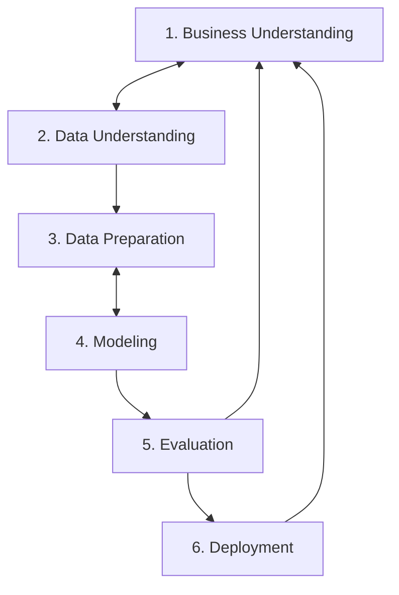
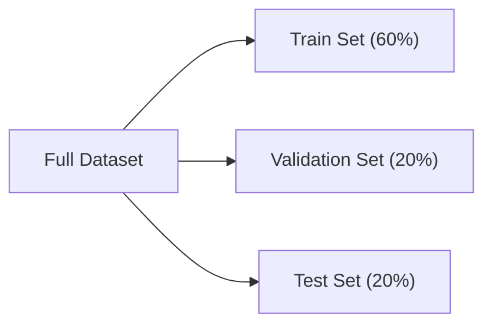
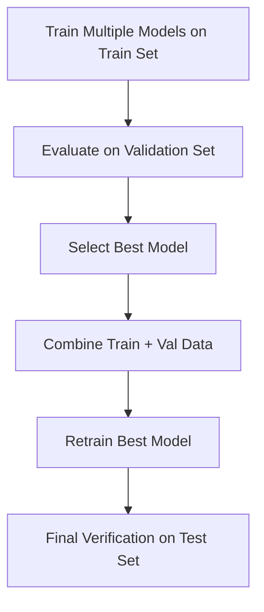

# Module 1
## 1.1  Introduction to machine learning

<b>Model Training</b>

Features of Data  + Target of data -> feed to machine learning -> Result will be a machine learning model which will predict target.


<b>Using a Model</b>

Feeding features from data to machine learning model -> Predict a Target from the data

<b>Features and Target</b>

Features are useful/key information about the objective.

Target is the end value we want to predict.

## 1.2 Rule Based System vs Machine Learning

### Key Comparison 

| Feature | Rule-Based System | Machine Learning System |
| :--- | :--- | :--- |
| **Logic Source** | Explicit rules written by software engineers | Automatically learned patterns from data |
| **Input to System** | Data + Rules | Data + Historical Labels |
| **Output** | Prediction / Decision | Model / Rules $\rightarrow$ then Predictions |
| **Adaptability** | Low (requires manual code updates) | High (retrain on new data) |
| **Maintenance** | Complex & fragile as rules grow | Structured pipeline & automated training |


## 1.3 Supervised Machine Learning

Supervised ML is first we feed/train ml algo on some features and target and tell exactly what we want to predict from our model. Then on test data we provide features on which it predicts target.

```text
[ 1, 0, 1, 1, 1 ]                                    [1]
[ 1, 1, 1, 0, 1 ]                                    [1]     
[ 1, 1, 1, 1, 1 ]   = X (features)           [1]   =  y(target)
[ 1, 0, 1, 0, 0 ]                                    [1]
[ 1, 0, 1, 0, 1 ]                                    [1]
```

So, our primary goal is to train the ml model in such a way that while using the model, ``` g(X)≈y ``` where, ``` g = ML model, 
X = Features matrix, 
y= Target vector ```

<b>Types of Supervised Machine Learning</b>

1.Regression - where your ml model predicts a numerical value. Ex- Car/House price prediction.

2.Classification - where your ml model predicts a categorical value.
  
2.1 Multiclass Classification- where your ml model have to predict a value from more than 3 category. Ex- Object detection.

2.2 Binary Classification-  where your ml model have to predict a value from 2 category. Ex- Spam detection.

3.Ranking - where your ml model predicts the probability of you liking something/a product (aka Ranking). Ex- Recommendation system.

## 1.4 CRISP-DM

<b>What is CRISP-DM?</b>

CRISP-DM stands for **CRoss Industry Standard Process for Data Mining**. It is a standard methodology for organizing and structuring end-to-end Machine Learning projects.

It is an **iterative process** (not a one-way street), meaning insights gained in later steps often require looping back to refine earlier steps.

---

### The 6 Steps of CRISP-DM




## 1.5 Model Selection Process

<b>Goal</b>
Train multiple candidate models (e.g., Logistic Regression, Decision Trees, Neural Networks) and select the one that generalizes best to unseen data.

---

### The 3-Way Data Split

To avoid the **Multiple Comparison Problem** (a model getting lucky on a single validation set by pure chance), split data into three separate sets (e.g., 60% / 20% / 20%):

* **Train Set ($X_{train}, y_{train}$):** Used strictly to fit/train candidate models.
* **Validation Set ($X_{val}, y_{val}$):** Used to evaluate, compare, and select the best model.
* **Test Set ($X_{test}, y_{test}$):** Untouched set used only at the very end to verify real-world generalization.



---

### Workflow



<b>Steps:</b>
1. **Train & Validate:** Train candidate models on `Train`, compare accuracy on `Validation`, and pick the top performer.
2. **Combine & Retrain:** Merge `Train + Validation` data and retrain the winning model to maximize training data.
3. **Test:** Evaluate once on `Test` to ensure validation performance was not due to luck.

## 1.6 Github Codespaces 

In this module we majorly learned how to submit homework of this zoomcamp using github.

## 1.7 Introduction to Numpy

 <b>introduction_to_numpy.py in Folder 1.7</b>

## 1.8 Linear Algebra Refresher

 <b>linear_algebra_refresher.py in Folder 1.8</b>


<b>1. Vector Operations</b>


<b>2. Multiplication
- Vector-Vector Multiplication</b>


<b>        

- Matrix-Vector Multiplication</b>


<b>        

- Matrix-Matrix Multiplication</b>


<b>3. Identity Matrix</b>


<b>4. Inverse of a Matrix</b>

***NOTE :  To calculate inverse of a matrix , the matrix should be a square matrix***


<b>5. A x A⁻¹ = Identity Matrix</b>


