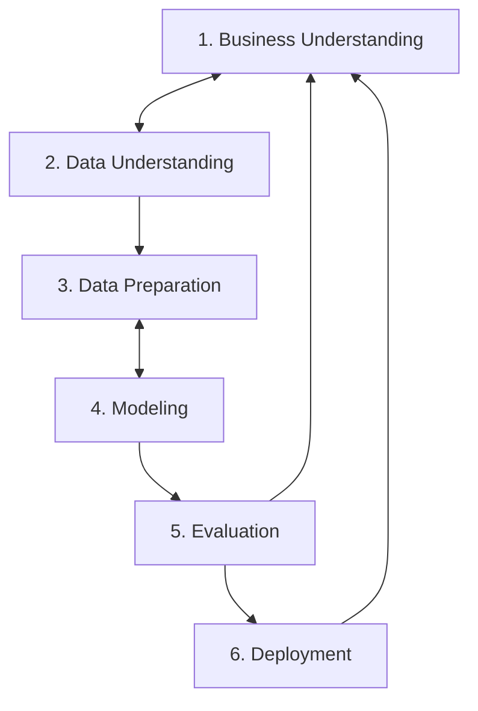
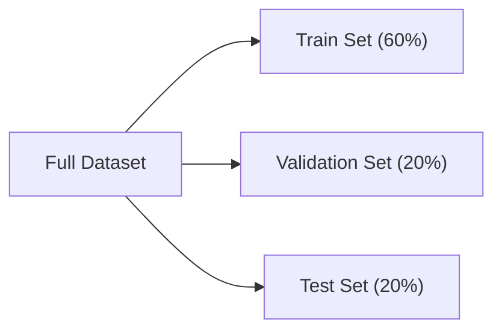
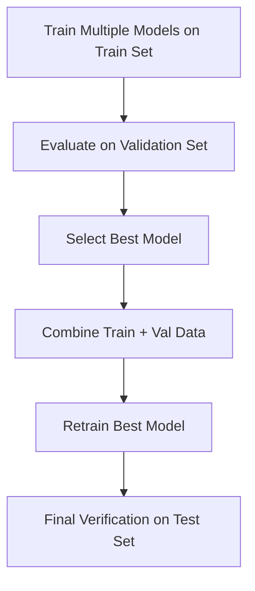
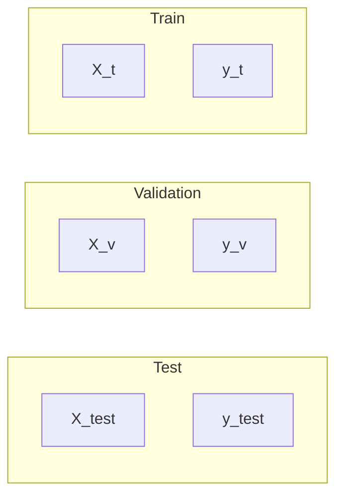

# Module 1 -- Introduction

## 1.1  Introduction to machine learning

<b>Model Training</b>

Features of Data  + Target of data -> feed to machine learning -> Result will be a machine learning model which will predict target.


<b>Using a Model</b>

Feeding features from data to machine learning model -> Predict a Target from the data

<b>Features and Target</b>

Features are useful/key information about the objective.

Target is the end value we want to predict.

## 1.2 Rule Based System vs Machine Learning

### Key Comparison 

| Feature | Rule-Based System | Machine Learning System |
| :--- | :--- | :--- |
| **Logic Source** | Explicit rules written by software engineers | Automatically learned patterns from data |
| **Input to System** | Data + Rules | Data + Historical Labels |
| **Output** | Prediction / Decision | Model / Rules $\rightarrow$ then Predictions |
| **Adaptability** | Low (requires manual code updates) | High (retrain on new data) |
| **Maintenance** | Complex & fragile as rules grow | Structured pipeline & automated training |


## 1.3 Supervised Machine Learning

Supervised ML is first we feed/train ml algo on some features and target and tell exactly what we want to predict from our model. Then on test data we provide features on which it predicts target.

```text
[ 1, 0, 1, 1, 1 ]                                    [1]
[ 1, 1, 1, 0, 1 ]                                    [1]     
[ 1, 1, 1, 1, 1 ]   = X (features)           [1]   =  y(target)
[ 1, 0, 1, 0, 0 ]                                    [1]
[ 1, 0, 1, 0, 1 ]                                    [1]
```

So, our primary goal is to train the ml model in such a way that while using the model, ``` g(X)≈y ``` where, ``` g = ML model, 
X = Features matrix, 
y= Target vector ```

<b>Types of Supervised Machine Learning</b>

1.Regression - where your ml model predicts a numerical value. Ex- Car/House price prediction.

2.Classification - where your ml model predicts a categorical value.
  
2.1 Multiclass Classification- where your ml model have to predict a value from more than 3 category. Ex- Object detection.

2.2 Binary Classification-  where your ml model have to predict a value from 2 category. Ex- Spam detection.

3.Ranking - where your ml model predicts the probability of you liking something/a product (aka Ranking). Ex- Recommendation system.

## 1.4 CRISP-DM

<b>What is CRISP-DM?</b>

CRISP-DM stands for **Cross Industry Standard Process for Data Mining**. It is a standard methodology for organizing and structuring end-to-end Machine Learning projects.

It is an **iterative process** (not a one-way street), meaning insights gained in later steps often require looping back to refine earlier steps.

---

### The 6 Steps of CRISP-DM




## 1.5 Model Selection Process

<b>Goal</b>
Train multiple candidate models (e.g., Logistic Regression, Decision Trees, Neural Networks) and select the one that generalizes best to unseen data.

---

### The 3-Way Data Split

To avoid the **Multiple Comparison Problem** (a model getting lucky on a single validation set by pure chance), split data into three separate sets (e.g., 60% / 20% / 20%):

* **Train Set ($X_{train}, y_{train}$):** Used strictly to fit/train candidate models.
* **Validation Set ($X_{val}, y_{val}$):** Used to evaluate, compare, and select the best model.
* **Test Set ($X_{test}, y_{test}$):** Untouched set used only at the very end to verify real-world generalization.



---

### Workflow



<b>Steps:</b>
1. **Train & Validate:** Train candidate models on `Train`, compare accuracy on `Validation`, and pick the top performer.
2. **Combine & Retrain:** Merge `Train + Validation` data and retrain the winning model to maximize training data.
3. **Test:** Evaluate once on `Test` to ensure validation performance was not due to luck.

## 1.6 Github Codespaces 

In this module we majorly learned how to submit homework of this zoomcamp using github.

## 1.7 Introduction to Numpy

 <b>refer introduction_to_numpy.ipynb in Folder 1.7</b>

## 1.8 Linear Algebra Refresher

 <b>refer linear_algebra_refresher.ipynb in Folder 1.8</b>


<b>1. Vector Operations</b>


<b>2. Multiplication
- Vector-Vector Multiplication</b>


<b>        

- Matrix-Vector Multiplication</b>


<b>        

- Matrix-Matrix Multiplication</b>


<b>3. Identity Matrix</b>


<b>4. Inverse of a Matrix</b>

***NOTE :  To calculate inverse of a matrix , the matrix should be a square matrix***


<b>5. A x A⁻¹ = Identity Matrix</b>


## 1.9 Introduction to Pandas

 <b>refer introduction_to_pandas.ipynb in Folder 1.9</b>

## 1.10 Summary of Module-1

Module 1 completed.


# Module 2 -- Regression

## 2.1 Project Overview - Car Price prediction Project

### Project Objective
Predict the price of a car based on a dataset from kaggle using linear regression.

---

### Project Plan
1. Data preparation and EDA (Exploratory Data Analysis).
2. Use Linear Regression for predicting price.
3. Understand the internals of linear regression.
4. Evaluating the model with RMSE.
5. Feature Engineering.
6. Regularization.

---

## 2.2 Data Preparation

 <b>car_price_prediction_project.ipynb in Folder Module 2</b>


## 2.3 Exploratory Data Analysis

 <b>refer car_price_prediction_project.ipynb in Folder Module 2</b>

## 2.4 Setting up Validation Framework

***To implement Linear Regression we have to split the data into 3 parts-> TRAIN , VALIDATION, TEST***




 
 
  Before splitting the dataframe, we will shuffle it, because sequential order of dataset can be a risk -- creating subsets that represent completely different distributions or biases.

 After splitting the data, 
 1. Extract target vectors: Isolate the target variable into y_train, y_val, and y_test to keep features and labels distinct.
   
 2. Drop target from feature sets: Remove the price column from X_train, X_val, and X_test to prevent target leakage.
 
 3. Apply log transformation: Transform the target vectors using $\log(1 + y)$ to reduce right-skewness, stabilize variance, and mitigate the impact of price outliers on error metrics.

 refer car_price_prediction_project.ipynb in Folder Module 2.


## 2.5 Linear Regression

<b>Goal:</b>

%7D%20%5C%5C%20y%20%26%3A%20%5Ctext%7Btarget%20%28Price%29%7D%20%5Cend%7Baligned%7D)

---
<b>Lets perform Linear regression on a single row of data i.e df.iloc[10]</b> :


$$g(x_i) = w_0 + \sum_{j=1}^3 w_j \cdot x_{ij}$$

Where:

* $x_i$ is the feature vector of row $i$ (the data point or observation).
* $w_0$ is the base weight (bias / intercept).
* $w_1$ to $w_3$ are the feature weights corresponding to each feature $j$.
* $x_{ij}$ is the value of feature $j$ for row $i$.


 refer car_price_prediction_project.ipynb in Folder Module 2.

---

## 2.6 Linear Regression: Vector Form

***1. Implementing LR on a single vector of feature matrix using this approach:***

$$g(x_i) = w_0 + \sum_{j=1}^3 w_j \cdot x_{ij}$$
 

***2. Implementing LR on a single vector of feature matrix using new approach:***

$$g(x_i) = \sum_{j=0}^{n} w_j \cdot x_{ij}$$

This approach implements the linear regression using the bias-trick representation. Rather than separating the weight $w_0$ from the feature weights, it absorbs the bias term directly into the weight vector as its first element, creating $\mathbf{w} = [w_0, w_1, \dots, w_n]^T$. Correspondingly, the input feature vector has its first feature as 1, yielding $\mathbf{x}_i = [1, x_{i1}, \dots, x_{in}]^T$. 

This approach makes dot product b/w weights and features vector possible without a additional add operation, because now the shape of both is same.

***3. Implementing LR on a custom feature matrix using new approach:***

$$\mathbf{g}(\mathbf{X}) = \mathbf{X}\mathbf{w}$$

$$
\begin{bmatrix} g(\mathbf{x}_1) \\ \vdots \\ g(\mathbf{x}_m) \end{bmatrix}
=
\begin{bmatrix} 1 & x_{11} & \cdots & x_{1n} \\ \vdots & \vdots & \ddots & \vdots \\ 1 & x_{m1} & \cdots & x_{mn} \end{bmatrix}
\begin{bmatrix} w_0 \\ \vdots \\ w_n \end{bmatrix}
$$

where X is a square matrix with first column elements as 1.

***refer car_price_prediction_project.ipynb in Folder Module 2.***


## 2.7 Training Linear Regression Model: Normal Equation

***Deriving the Normal Equation for Linear Regression***

#### 1. Our Goal
Our goal is to find a weight vector $w$ such that the predicted values closely approximate our target values $y$:
$$g(X) = Xw \approx y$$

---

#### 2. The Ideal Scenario (If $X$ were Square and Invertible)
If $X$ is a square and invertible matrix, we can solve for $w$ by multiplying both sides by the inverse of $X$ ($X^{-1}$):

$$X^{-1} \cdot Xw = X^{-1} \cdot y$$

Since $X^{-1} \cdot X = I$ (the Identity matrix):
$$I \cdot w = X^{-1} \cdot y$$

And since any matrix multiplied by the Identity matrix remains unchanged ($I \cdot w = w$):
$$w = X^{-1} \cdot y$$

---

#### 3. The Catch with Rectangular Matrices
There is a major catch with this approach: **to find a standard inverse, the matrix must be square** (equal rows and columns). 

In real-world machine learning, our feature matrix $X$ is almost always a **rectangular matrix** (more samples/rows than features/columns). Because of this, a standard inverse $X^{-1}$ does not exist.

---

#### 4. Using the Gram Matrix to Fix Shape
To turn our rectangular feature matrix into a square matrix, we multiply it by its transpose ($X^T$). 

The result, $X^T X$, is a **Gram matrix**, which is **always a square matrix**. 

While a Gram matrix's inverse doesn't *always* exist (it depends on conditions like linear independence and having enough samples), for our current intuition, we assume the inverse exists.

---

#### 5. Deriving the Normal Equation (Pseudoinverse)
To solve for $w$ using the Gram matrix, we multiply both sides of our original equation by the pseudoinverse components:

$$(X^T X)^{-1} \cdot X^T \cdot Xw = (X^T X)^{-1} \cdot X^T \cdot y$$

*(Where $X^T X$ is our Gram matrix)*

Since $(X^T X)^{-1} \cdot (X^T \cdot X) = I$ (the Identity matrix):
$$I \cdot w = (X^T X)^{-1} \cdot X^T \cdot y$$

Finally, since $I \cdot w = w$, we arrive at the final **Normal Equation** for Linear Regression:
$$w = (X^T X)^{-1} X^T y$$

---

### Now that we know how to implement normal equation, lets implement this in code, here- ***car_price_prediction_project.ipynb in Folder Module 2.***

This normal equation will help us to get ideal weights for our model's test and validation.

## 2.8 Baseline Model for Car Price Prediction Project

In this section,
1. Extract Numerical columns from our X-train dataframe to make them features.
2. Then we fill missing values of those features as 0.
3. We finally make feature matrix  'X' which consist values of features but without bias.
4. Now we will add bias to our feature matrix.
5. We will print our y-train vector to see its okay or not.
6. Now we will feed the X-train and y-train to the previously made train_linear_regression() model, this model uses normal equation to calculate weights for validation and test, by using X-train and y-train data.
7. Now, we will do dot product of X-train and weights, which will be our Prediction (y_pred).
8. Now, we will make a seaborn histplot to see residual (difference b/w predicted target {y_pred} vs target value {y_train}).
   
---
  ![Prediction vs Actual](data:image/png;base64,iVBORw0KGgoAAAANSUhEUgAAAjYAAAGYCAYAAABRSKg2AAAAAXNSR0IArs4c6QAAAARnQU1BAACxjwv8YQUAAAAJcEhZcwAADsMAAA7DAcdvqGQAAEOwSURBVHhe7d15WFRl/z/wNwyyuLAoKiC4oyLgko+Iy6NkmqCGWha5lmJpprmQGk/2pFli5oLiViaamluW+66JuSvihvsGIvsOimwz5/fHN8+Pc9iGJx1mDu/XdX2ui7nvzz06QM67c+5zxkgQBAFERERECmAsHyAiIiIyVAw2REREpBgMNkRERKQYDDZERESkGAw2REREpBgMNkRERKQYRlX5cm+NRoO4uDjUqlULRkZG8mkiIiLSQ4IgIDs7Gw4ODjA2lh6jqdLB5smTJ3BycpIPExERkQGIiYmBo6OjZKxKB5vMzExYW1sjJiYGlpaW8mkiIiLSQ1lZWXByckJGRgasrKwkc1U62GRlZcHKygqZmZkMNkRERAairPdvbh4mIiIixWCwISIiIsVgsCEiIiLF4B6bUs7RERGR4VCr1SgoKJAPk4GqVq0aVCqVfFhU1vs3g00p3xgiItJ/giAgISEBGRkZ8ikycNbW1rCzsyvxPnNlvX8z2JTyjSEiIv0XHx+PjIwM1KtXD9WrVy/xTZAMiyAIyMnJQVJSEqytrWFvby9vKfP9m8GmlG8MERHpN7Vajbt376JevXqoU6eOfJoMXGpqKpKSktCiRYtip6XKev/m5mEiIjJIL/bUVK9eXT5FCvDi51rRvVMMNkREZNB4+kmZ/tefK4MNERERKQaDDRER0Ut05coVeHt7l1lHjhyRL9Opbdu24bPPPpMPKwKDDRER0Uvk5OSEyZMni1VQUIC4uDjJWOvWreXLdOrhw4c4c+aMfFgReFVUKbuqiYhIv+Xm5uLRo0do0qQJzM3N5dN6Y/jw4Xjy5AnCwsIAACkpKRg+fDjw943omjZtio8++ghubm7immvXrmH69OlYtmwZFi9ejOjoaHz//fdwdXXF+fPnsXLlSuTl5cHT0xONGzfG3r17sXr1anF9QkICli1bhsjISNSvXx/vvfce3njjDQDAoUOH8NlnnyEhIQGdO3cGAEyZMgV9+vQR1+uDsn6+Zb1/84gNERGRDtWqVUs8cjNmzBiYmZmhY8eOuHr1qtiTlpaGQ4cO4c0330SLFi3w6aefokGDBoiIiED37t1hYWGBQYMG4fz58xgxYgROnjwpro2KikL79u2RkpKCESNGoHXr1nj//fexZs0aAICrqyu6du2K+vXri38PV1dXcb2h4xGbUhIfkSHy8vJBYmKqfFhUv34dhIUdkA8TGaSy/o9en8iP2JTE398fAMTwERYWhtdffx07duzAwIEDxb5BgwZBEATs3LlTHPP09ERGRgZu374NABgyZAgsLCwQGhoq9mzatAkBAQGIj48HAMybNw/bt29HeHi42KNvyvr5lvX+zSM2RAqSmJgKP78LpVZZoYeIdCc8PByTJk3CoEGD4O3tjVOnTuH+/fvyNvTo0UPy+Pz58+jbt69kTP74yJEjCA8PR//+/dGvXz/07dsXK1asQEJCAtLS0iS9SlRpwebs2bNYs2YNNmzYgDt37sinAQB3797F6tWrsWHDBiQnJ8unAS17iIiI9MXx48fRrVs3mJubY8iQIZg8eTI8PT3x7NkzeStq1aoleZyRkVHsCIX8cWZmJnr37o0JEyZg4sSJ+OyzzzBz5kwcOHAANWrUkPQqkc6DTUFBAfr164cBAwbgzJkz2Lt3L9q1a4eZM2dK+latWoV27drh0KFDWLduHZydnXHq1KkK9xAREemTLVu2YNCgQfj+++/x3nvvwdvbG8bG2r0dN27cGA8ePJCMyR83adIEhYWFxS4x9/b2hpmZGfAPbn5nCLT7Tr5Ef/75J/bv348TJ05gzZo12Lp1K5YtW4a5c+eKn84aGxuLyZMnY+nSpdi+fTuOHTuGQYMGwd/fHy+2BGnTQ0REpG+qV6+OqKgoqNVqAEBERAS2bNkibyvRkCFDsHr1aiQlJQEAHj16hE2bNkl6Pv74Y6xevRpnz54VxzIyMvDTTz+Jj+vWrYvExETxsZLoPNiYmpoCssNrlpaWqFatmpggd+3aBRMTE/FyOAD45JNPcPfuXVy5ckXrHiIiIn0zefJkxMfHw9nZGZ6enujTpw88PT3lbSWaOnUqGjdujJYtW6Jr167o2rUrPDw8YGJiIun59NNP0bNnT7Rr1w7/+te/4ObmBo1GI/b069cPhYWFaNOmDby9vXHo0CFxztBVylVR06ZNw/HjxzFw4EA8e/YMu3fvRmBgoBhSJkyYgLCwMERGRoprXuyA3rhxI4YNG6ZVj1xeXh7y8vLEx1lZWXBycipxVzWRIXJx8YCf3wX5sGjrVg/culX6PJEhKeuqGX1y7do15ObmwsPDQxzLzc3FlStXUFhYiHbt2iE5OVlyX5m0tDRcuHABffr0KXbaSBAEXLlyBfn5+XB1dcWcOXMQHh6OY8eOSfrS09Nx/fp11KpVC61btxZPQ72Qk5OD69evIyMjA66urnB0dJTMV7ayfr56dVWURqOBubk50tLS8ODBAzx48AC5ubmS84vZ2dmwtraWrLO0tIRKpUJ2drbWPXJBQUGwsrISy8nJSd5CRET0UrVp00YSagDA3Nwcnp6e6NatG2rWrIkmTZqIoQYAateuDW9v72Kh5tmzZzh48CDat2+PTp06ITk5GWvXroWPj4+kDwBsbGzQvXt3tG/fvliowd+nxDp16oQ+ffroXaj5J3QebDZt2oQFCxbgzz//xNq1a7Ft2zYsXLgQI0eOxN27d4G/v9nycPLs2TOo1WrxY8y16ZELDAxEZmamWDExMfIWIiIivWVmZoYVK1agZcuW6Ny5M1xdXeHt7Y2JEyfKW6ssnQebixcvwtnZGY0bNxbHevfuDbVajYiICABAixYt8PjxYxQWFoo9L3Z9Ozs7a90jZ2ZmBktLS0kREREZChMTE+zZsweHDh3CDz/8gAcPHmD9+vUlHpGpqnQebJo2bYpHjx4hNfX/3yjs4sWL4hwA9O/fH1lZWdi7d6/Ys379ejg4OIiH87TpISIiUqLGjRujW7dusLe3l09VeToPNv7+/mjUqBG6dOmC2bNnY/r06XjnnXfg5+cnBhJnZ2cEBgbigw8+wLRp0+Dv74+lS5di+fLlUKlUWvcQERFR1aLzYFOzZk1cvnwZs2bNglqthqWlJTZv3lzsGv5vv/0Wf/zxB0xNTdGoUSNcvnxZ8nkZ2vYQERFR1VEpl3vri7IuFyMyRLzcm6qSsi4HJsNX1s+3rPdvnR+xISIiInpVGGyIiIhIMRhsiIiIFGzZsmWIjo4G/r5rcXBwMJ48eSJv09rLeI5XicGGiIhIh27cuIHg4GAEBwdj6dKl2LZt2yu9Yeznn3+OW7duAQDUajWmTJmC+/fvy9tKpFarERwcjLi4OMlYRZ5D1xhsiIhIUTq4u8PB1lZn1cHdXf5XKNPZs2cxdepUREVF4cGDB1izZg2aN2+O1atXy1tfOmNjY0yaNEnrj1AoKCjAlClT8PDhQ3Gsos+ha7wqqpRd1USGiFdFUVVS2lUzDra2iJswQdL7KjksW4a4lBT5cKl+/vlnjBs3TnLn/GnTpmHZsmVIT0/H3r170aBBA9SvXx9hYWGwtrbG22+/DQBISEjA0aNHUVBQgNdeew1t27Yt8sz/5+LFi4iIiEDjxo3h5eUFKysr7Ny5E97e3hAEAUuWLMHgwYMlwSQxMRHHjh1Dfn4+Xn/9dTRq1AgAsGTJEkyePBmfffYZmjRpAltbWwwbNqzE57h79y5OnDgBExMT9OzZU3wO/P0h1CtXrsTQoUMRHR2Na9euwc7ODt7e3qXee660ny/Kef/mERsiIqJK9vrrryM3NxdRUVFYtmwZPvnkE/Tp0wdnzpxBYmIiAGDz5s1o1aoVdu7ciZMnT+LNN9/ElClTJM8zZ84cdO/eHWFhYQgODkaXLl2gVqvF+ZJOI/36669o0qQJQkNDceLECXh7e2P37t0AIJ4ii4+PR1RUFGJjY0t8jkWLFqFNmzY4cuQIdu7ciZYtW2LDhg3i/PPnzzFlyhQMHDgQkydPxrlz5zBu3Dj0799f7HlZGGyIiIgq2ZUrV2BsbCweAUlISMCFCxfw888/45NPPkFMTAxGjx6N/fv3Y/v27QgNDUVERATWrFmDv/76CwDw8OFDfPPNN9i+fTs2b96MAwcOoE+fPpIjQ3KPHj3CqFGjsGDBAhw9ehRr167F5cuX4eTkBPx9I1wA+OyzzxAcHIwZM2bInuH//tzAwEBs2LAB27Ztw65duxAUFISJEydKPj4JAFq3bo3Tp09j9erVCAsLw8GDB3Hp0iVJzz/FYENERKRjL64sWrx4McaNG4fZs2fjyy+/RM2aNQEAvr6+sLGxEfv/+OMPVK9eHREREQgJCUFISAh+//132Nra4vTp0wCA/fv3w97eHv369RPXffrpp+LXJdmxYwesra0xbtw4cczc3Bzt27eX9JXl4MGDqFOnDt59911xbPz48cjJyRFD1wtDhw4Vv27WrBlq164tfoD1y8JgQ0REpGOCICAqKgoxMTFo3LgxwsLC8M0334jz9erVk/Q/efIE1apVw/379/HgwQM8ePAADx8+hK+vL1xdXQEAsbGxaNCggWSdg4MDjI1Lf6uPj49Hw4YNy+wpT0xMTLE/18zMDPXq1St2tZd8P0y1atWQn58vGfun/vdXQkQ65+XlAxcXj1IrOvrVXTJKRC+PsbExgoODsWjRInzxxRfo3LmzvEWiTp064qXX8vL19QUA1K9fH8nJyZJ1KSkp0Gg0krGi6tSpg4SEBPlwhdjZ2RX7czUaDVJTU2FnZycZ1wUGGyIDkpiYCj+/C6VW0U2CRKQcb731FlJTU7Fu3TrJeEpKiri5uGfPnnj48CEuXPj/Vz5u3LixSHdx/fv3R1xcHHbt2iWOCYKAR48eAX8feTEzM0NOTk6RVVI9e/ZETEyM5LTT1q1bAQBdu3Yt0qkbDDZERER6ztXVFT/88AM++ugjDB8+HN999x1Gjx6Nzp07Iz09HQDQpk0b+Pv7o2/fvvjPf/6D8ePHIyQkpNTLqQHAzc0Nc+bMwXvvvYePPvoIs2fPRrdu3XDy5EkAgJGREbp06YLZs2dj4cKFJQYld3d3TJo0CQMGDMCMGTMwefJkjB49GrNnzy52ikoXGGyIiIh0yM3NDZMmTZIPiwYPHowuXbrIhxEQEICrV6/C3d0dT58+RY8ePRAREYFWrVqJPT/99BNWrFgBjUaDNm3a4OLFi5gyZQoaN24MlHJzvS+//BJnzpxBw4YNYWRkhEWLFmHkyJHi/O+//473338f8fHxiI2NLfE5Fi1ahG3btsHExASWlpY4duwYpk+fLs6bmZlh0qRJqF+/vjgGAB9//DFcXFwkY/8Ub9BXyg1+iPRReTfgCwqqh8DAJPmwiDfoIyUp7QZuHdzdER8fL+l9lezt7XHp+nX5MP1Dpf18Uc77N4NNKd+YV83LyweJidLr+4uqX78OwsIOyIepimOwIfr/ynrjI8NX1s+3rPdvnoqqJOVtAi0r9BAREVHJGGyIiIhIMRhsiIiISDEYbIiIiEgxGGyIqpDo6Ohidyt+UV5ePvJ2IiKDw2BDVIWo1UKxjercsE5ESsJgQ0RERIrBYENERGSAkpOTi316NjHYEBER6Ux8fDyioqLkw6LHjx8jLi5OPlyihQsXYtSoUfLhKo/BhoiIFMXLy6fY5vhXWRXZeL979264uLggIyNDPoWcnBy4ublhy5Yt8imqAH6kQim3ZH7VXMq5NT5vfU8lKe/3pryPVChrnr9zZGhKu+V+ef+dvGwV+W8nKysL9vb2+OGHHzB+/HjJ3Lp16zB27FjExsZCpVIhMTERAGBpaQkHBwdJLwB88cUXCA8Px9GjRwEAcXFxMDY2hp2dndiTkpKCnJwcNGzYsMhKID8/H3FxcbCzsyv2cQX6orSfL8p5/+YRGyIiIh2xtLTEu+++i9DQUPkU1qxZA19fX9ja2mLPnj0YOHAgBg4ciNdeew1169Yt90jO1KlTMXPmTMnYsmXLMHToUPGxIAiYPXs26tati+7du8PW1hZDhw5FVlaWZJ0hY7AhIiLSoTFjxuDSpUu4evWqOHb37l2cOnUKY8aMAQCMHDkSt2/fxu3bt5GQkICffvoJ/v7+ePz4cZFnqrglS5Zg8+bNuHLlCh4/fozY2FjExcVhxowZ8laDxWBDRESkQ926dUPLli0lR21CQ0PRsGFD9O7dW9KbnZ2Ne/fuwcXFBfXr18fJkycl8xW1ePFijBw5Emq1Gvfu3UNiYiLeffdd/PHHH/JWg8VgQ0REpGP+/v749ddfkZeXh8LCQqxfvx6jRo2CsfH/vS1HRkbCw8MD9erVQ+/evTFw4EDEx8cjNjZW/lRae/r0KR4/fowff/wR/fv3x1tvvQVfX1+EhISgdu3aKCgokC8xSDoPNo8fP8bevXtLrGfPnkl6s7Ozcfz4cZw9exaFhYWSuRe06SEiItInH3zwAbKysrBr1y7s378fiYmJGD16tDg/atQotGvXDunp6YiKisLt27fRsGFDaDQayfMUZWRkJB+SvC+amJjAyMgIQUFB4mmuF3Xr1i1Uq1ZNstZQ6TzY3LhxA6tWrZLUxIkT8fbbbyM3N1fs27t3L5ycnDBlyhQMGzYMLVu2xJ07dyTPpU0PERGRvqlXrx769++P0NBQhIaGolevXpIrl27dugVfX1/xaqCoqCg8fPiwyDMUV7duXcTHx0vGrly5In5tbm6ODh06YPv27ZIeAIo5WoPKCDY+Pj7FjtTUrFkTvr6+qFOnDgAgLS0Nw4cPR0BAAK5cuYL79++jVatWGDFihPg82vQQERHpqzFjxuDIkSPYt2+fuGn4hc6dO+OHH37AuXPncPDgQQwcOBDl3Z2lb9++OHz4MEJDQxEeHo6vvvoKhw4dkvT88MMP2LdvH8aNG4dTp07hxIkTmDVrFkaOHCnpM2Q6DzZyFy5cQGRkJD766CNxbNeuXXj+/DkmT54MADA2Nsbnn3+Oixcv4vbt21r3EBER6as+ffrA09MTbdu2xYABAyRz69evR9OmTTFu3Dh8//33mDhxIgYOHCgeAMDfR32KHuXx9vbGypUrsW7dOkydOhUmJiaYN28eGjVqJPZ4eXnh/PnzyMnJwcSJEzF79myoVCr89NNPYo+hq/Qb9I0dOxaHDh3Cw4cPxU1TkydPxqFDh3Dr1i2xLz09HbVr18aWLVvg5+enVY9cXl4e8vLyxMdZWVlwcnIq8QY/r1p5N5CqyA2fqOoo7/emrBvwoZx5/s6RoSntBm5eXj46/bT6+vXrICzsgHyY/qHSfr7Q5xv05eTkYMuWLfD39xdDDQBkZGSgdu3akl5ra2uoVCrxNtTa9MgFBQXByspKLCcnJ3kLEREZuLCwA7h164LOiqFGv1RqsPntt9/w7NkzyU5wADA1NUVOTo5kLC8vD2q1Gqamplr3yAUGBiIzM1MsfioqERGRslRqsPn555/h4+ODBg0aSMabNGmC2NhYyUapFyGkSZMmWvfImZmZwdLSUlJERESkHJUWbF7cPrropuEXvL29kZycjFOnTolj27dvh5WVFTw9PbXuISIioqql0oLNmjVr4ODggH79+smn0L59e4wYMQJDhw7Fjz/+iKCgIMyePRtz584VNxBp00NERERVS6UFm7S0NPz3v/+FSqWSTwEA1q5di5kzZ+LPP//ErVu38Pvvvxf7iHdteoiISNkq+eJeekX+159rpQWb1atXY+zYsfJhkUqlwtixY7F161asX7++xCM72vQQEZEyvfgIAPmFJKQML36uFf2oh0oLNkRERP+ESqWCtbU1kpKSkJqaiufPnyM3N5dl4PX8+XOkpqYiKSlJvI1LRVT6DfoqU1k3+HnVyrvRGm+WRiUp7/emrBvwoZx5/s6RIRIEAQkJCaXev4wMl7W1Nezs7Er8cM+y3r8ZbEr5xrxq5b1B8U2GSlLe701ZwQXlzPN3jgyZWq1W1Ac5VnXVqlUr80hNWe/fPBVFREQGT6VSwdzcnKWQKivUlIfBhoiIiBSDwYaIiIgUg8GGiIiIFIPBhoiIiBSDwYaIiIgUg8GGiAAA0dHRcHHxKLW8vHzkS4iI9A6DDREBANRqAX5+F0qtxMRU+RIiIr3DYENERESKwWBDREREisFgQ0RERIrBYENERESKwWBDREREisFgQ0RERIrBYENERESKwWBDVAk6uLvDwda2zOrg7i5fRkRE5WCwIaoE8fHxiJswocyKj4+XLyMionIw2BAREZFiMNgQERGRYjDYEBERkWIw2BAREZFiMNgQERGRYjDYEBERkWIw2BAREZFiMNgQERGRYjDYEBERkWIw2BAREZFiMNgQERGRYlRqsMnLy8Pjx4+h0WjkU6KYmBgkJyfLhyW06SEiIiLlq5Rgk5+fj0mTJqFOnTro3r07GjdujG3btkl6Ll26hBYtWsDd3R1OTk7o2bMnkpKSKtxDREREVUelBJuPPvoIe/bsQUREBKKionDt2jXExMSI8zk5OfD19cXrr7+O1NRUJCcn49mzZ/jggw8q1ENERERVi86Dzc2bN7F+/XosWbIELVq0AABYW1sjICBA7NmzZw8SExPx7bffQqVSoVatWpg5cyYOHjyI6OhorXuIKqKDuzscbG3LrA7u7vJlRESkR3QebA4ePAhzc3N4e3sjLS0N8fHx8hZcvHgRTZs2Rd26dcWxLl26AH+fftK2h6gi4uPjETdhQplV0u8rERHpD50Hm9jYWDg4OGDChAlwdnZG27ZtYW9vL9ljk5qaCltbW8k6GxsbGBsbIyUlReseuby8PGRlZUmKiIiIlEPnwcbY2BgPHz6Eubk5kpKSkJSUhICAAAwfPhx37twBAKhUKuTn50vWFRYWQqPRwMTEROseuaCgIFhZWYnl5OQkbyH6x7Q5pZWZkSFfRkREL4HOg82LMDF9+nSoVCoAwNSpU2FsbIwTJ06IPfJD/gkJCQAAR0dHrXvkAgMDkZmZKVbRDctEL4s2p7TKusUBERH973QebN544w0AQFpamjiWlZWFgoICWFlZAQC8vLwQFxeH69eviz379u2Dubk5PD09te6RMzMzg6WlpaSIiIhIOXQebFxdXTF06FD4+/vjzz//xJkzZzB06FA0btwYPj4+AIAePXrgjTfewIgRI3Ds2DH89ttv+PLLLxEQECCGEW16iIiIqGrRebABgLVr18LX1xeBgYEICAhA8+bNcfr0aUkg2bFjB3r37o3p06dj8eLF+Prrr/HNN99InkebHiIiIqo6KiXYmJqaYubMmTh//jzOnj2LpUuXws7OTtJTq1Yt/PDDD7h06RLOnDmDSZMmwdhY+tfVpoeIiIiqDqYAIiIiUgwGGyIiIlIMBhsiIiJSDAYbIj3itW4rXJath8uy9UhKV8PFxUNS0dG89xIRUVkYbIj0SOLTPPi5hcLPLRQWZoHw87sgKbVaLV9CRERFMNgQERGRYjDYEBERkWIw2BAREZFiMNgQGbAfV6zAwvnzxcrPz5c8Xjh/Pn5csUK+jIhIsRhsiAzY06dPEeDhIZapsUryOMDDA0+fPpUvIyJSLAYbIiIiUgwGGyIiIlIMBhsiIiJSDAYbIiIiUgwGGyIiIlIMBhsiIiJSDAYbIiIiUgwGGyI9lZubW+xme/Ib8OXm5sqXERFVaQw2RHpKEIRiN9uT34BPEAT5MiKiKo3BhoiIiBSDwYaIiIgUg8GGiIiIFIPBhoiIiBSDwYaIiIgUg8GGqAIyMzLgYGtbZmVmZMiXERGRjjDYEFWARqNB3IQJZZZGo5EvIyIiHWGwISIiIsVgsCEiIiLFYLAhIiIixWCwoSqhg7t7sU2+8uKmXyIiw8dgQ1VCfHx8sU2+8uKmXyIiw1cpwaawsLBY8cP8iIiI6J/SebB5+vQpqlWrBnNzc0lt2LBB0hcdHY2+ffvC3NwcVlZW+Pjjj5GTk1PhHiIiIqo6dB5sXjh16pTkiM3IkSPFucLCQvTt2xcqlQpRUVE4d+4c/vzzT3zyyScV6iEiIqKqpdKCTVkOHDiAmzdvYvny5bCzs4OLiwvmzJmDjRs3IjExUeseIiIiqloqLdh4e3vD1NQUrVq1wuLFi6FWq8W5M2fOoEmTJmjYsKE41rNnT2g0Gpw/f17rHiIiIqpadB5sjIyMMH78eISHhyM9PR3ffvstZs2ahW+++UbsSUxMRN26dSXrbG1tYWRkJB6N0aZHLi8vD1lZWZIiIiIi5dB5sKlRowaWL1+O5s2bo0aNGhg8eDBmzJiBxYsXa3VllJGRkXyomNJ6goKCYGVlJZaTk5O8hYiIiAyYzoNNSdzc3JCdnY2kpCQAgL29vfj1C8nJyRAEAXZ2dlr3yAUGBiIzM1OsmJgYeQsRlSI6OhouLh6llpeXj3wJEZHO6UWwuXr1KiwsLGBjYwMA6Nq1K6KiohAVFSX2HDt2DCqVCp06ddK6R87MzAyWlpaSIiLtqNUC/PwulFqJianyJUREOqfzYLN8+XIEBwfj4cOHSEtLw8aNGzF//nxMmDABpqamAIA+ffqgTZs2GDt2LKKjo3H58mXMnDkTH374obivRpseIiIiqlp0HmxGjBiB5ORkeHt7o1mzZli8eDEWLlyIefPmiT0qlQr79u1D9erV0aZNG/Tp0wf9+/fHsmXLKtRDREREVYvOg42lpSW+++473L17F+np6bh06RI+/vhjGBtL/yqOjo7YsWMHMjMzkZSUhJCQEJibm1e4h4iIiKoOnQcbIiIioleFwYaIiIgUg8GGiIiIFEPrYHP8+HHs3r1bPgyUM0dERESkK1oHm0uXLuGvv/6SDwMAwsPDcerUKfkwEemB3NxcLJw/Hwvnz0d+fr74ddH6ccUK+TIiIoOkdbApTUFBAa5cucJ7xxDpKUEQEODhgQAPD5gaq8Svi9bTp0/ly4iIDFK5wSY4OBjm5uYIDAwUvy5aZmZm2L9/P95++235UiIiIiKdKjfY+Pr6Yvv27Rg5cqT4ddEKCwtDVFQUmjVrJl9KREREpFPlBpumTZuif//++PbbbxEcHIz+/ftLqnv37rCyspIvIyIiItK5coPNC/b29mjYsCEAIC0tDQkJCZLKzs6WLyEiIiLSKa2DDQDMnTsXVlZWqFOnDuzt7SU1e/ZseTsRERGRTmkdbE6fPo3vvvsOixYtQkREBK5fvy6pzz//XL6EiIiISKe0DjbXrl3D+++/D39/f7Rv3x5ubm6SsrOzky8hIiIi0imtg03Dhg15rwsiIiLSa1oHm169euH+/fv4/fffoVar5dNERERElU7rYLN69WrcvHkTgwcPhoWFBaytrSX11VdfyZcQERER6ZTWwebNN9/Ehg0b8Ntvv2HTpk34+eefJfXee+/JlxARERHplNbBpkWLFhg8eHCp5e7uLl9CREREpFNaBxtBEFBYWFhqaTQa+RIiIiIindI62CxcuBDVqlUrtaZPny5fQkQGIjc3F/n5+Vg4f36pVZBfIF9GRKR3tA42fn5+OH78uKT27t2LsWPHwtnZGePGjZMvISIDIQgCTI1VCPDwKLUECPJlRER6R+tg4+TkBC8vL0n169cPq1atQuvWrXHr1i35EiIiIiKd0jrYlKV9+/a4fPmyfJiIiIhIp/5xsElLS8OePXtQt25d+RQRERGRTmkdbNasWYPmzZtLqkmTJrC3t0dubi6GDx8uX0JERESkU1oHm3/961/4/PPPJfXll19iz549uHz5MmrVqiVfQkRERKRTWgebtm3bYty4cZIaM2YM3nzzTVSrVk3eTkRERKRzWgeborKysnDz5k2kp6fLp4iIiIgqTYWCzfXr19GjRw9YWVnB1dUVtWvXRocOHXD27Fl5KxEREZHOaR1sMjIy8MYbb8DGxgZHjhzB7du3ERYWBjc3N/Tu3RsxMTHyJUREREQ6pXWw2bdvH5o3b44dO3agV69eaNmyJXr06IFffvkFvXr1wm+//SZfQkRERKRTWgebtLQ0uLq6wsjISD4FNzc3pKamyoeJiIiIdErrYOPq6op9+/YhLi5OMp6eno7ffvsNrq6uknFtZGdno2PHjnB0dERCQoJkLj09HePHj0fLli3Rtm1bzJ07F2q1usI9REREVHVoHWx69uyJ9u3bo1WrVhg5ciQCAwMxevRoNG/eHNbW1nj33XflS8o1btw4mJubIzY2FoWFheK4IAjw9fXFpUuX8Msvv2DevHkIDg7GjBkzKtRDREREVYvWwQYA9uzZg+DgYGRnZ+Po0aNISUnBrFmzcOrUqQrfy2bt2rW4f/8+vvzyS/kUjh8/jlOnTmHdunXw9PSEj48P5s6di5CQEGRkZGjdQ0RERFVLhYKNsbExRo8ejR07duDixYvYvXs3Jk6cWOFQc+fOHQQGBuLXX3+FiYmJfBonTpyAo6MjXFxcxDFvb2/k5+fj3LlzWvcQERFR1aJVsDl16hSuXr0qHwYA3Lt3D4cPH5YPlyovLw9+fn747rvv0Lx5c/k0AODJkyews7OTjNWvXx8AEBsbq3WPXF5eHrKysiRFREREylFusCkoKMDo0aNRp04d+RTwd5gYN24cMjMz5VMlmjZtGpo1awZ/f3/5lEij0RQ7kqNSqWBsbCxuDtamRy4oKAhWVlZiOTk5yVuIiIjIgJUbbE6ePIlGjRrB0dFRPgUAsLS0RNeuXbF//375VIl2794tnkZydHTEkCFDAAAdO3bErFmzAAB169ZFSkqKZF1aWho0Gg3q1q2rdY9cYGAgMjMzxeJNBZWhg7s7HGxty6xM7rsiIqoSyg029+7dg7Ozs3xYonnz5rh37558uETnzp3DlStXcO7cOZw7dw4hISHA3xuTp0yZAgDw8PDAw4cPJZeAnzx5EkZGRvjXv/6ldY+cmZkZLC0tJUWGLz4+HnETJpRZGo1GvoyIiBSo3GADAM+fP5cPSZQ3X5SdnZ14tMbR0RG2trbiuJWVFQCgf//+cHJywvTp05GXl4eUlBR888038PX1FU8fadNDREREVUu5waZNmzY4fPgwcnNz5VPA33td9u3bh7Zt28qn/mfm5ubYs2cPrl+/Dmtrazg4OMDR0RGhoaEV6iGil2vh/Pml1r2799DB3V2+hIhIp8oNNp6enqhbty78/PyKXW2UkpKCUaNGITs7Gz4+PpI5bf373/9GTEwM7O3tJePu7u64fPky4uLikJaWhj179qB27doV7iGilyfAw6PUcraxQXx8vHwJEZFOlRtsjIyMsHnzZly6dAnNmzdHx44dMXDgQHh6eqJx48bYt28ffvvtN5iamsqXasXMzAyOjo5QqVTyKQCAjY0NatasKR+W0KaHiIiIlK/cYAMALi4uuH79OmbNmgVbW1vExsaiVq1amDZtGm7cuIGOHTvKlxARERHpnFbBBn8fFZkxYwYOHDiAixcv4siRI/j666/Fm+IRERERVTatgw0R/XNe67bCZdl65Ak14bJsfbGKzuTdsImI/gkGGyIdSnyaBz+3UBgjAH5uocVKrRHkS4iIqAIYbIiIiEgxGGyIiIhIMRhsiIiISDEYbIiIiEgxGGyIiIhIMRhsiIiISDEYbIiIiEgxGGyIiIhIMRhsiIiISDEYbIiIiEgxGGyIiIhIMRhsiIiISDEYbIiIiEgxGGyIiIhIMRhsiIiISDEYbIiIiEgxGGyIiIhIMRhsiIiISDEYbIiIiEgxGGyIiIhIMRhsiOiliM7MQFK6Gi4uHiWWl5ePfAkR0UvHYENEL4VaYwQLs0D4+V0osRITU+VLiIheOgYbIiIiUgwGGyIiIlIMBhsiIiJSDAYbIiIiUgwGGyIiIlKMSgk20dHRCAwMRP/+/TF8+HBs3rwZGo1G0pOfn49FixahX79+eOedd7Bt2zbJvLY9REREVHXoPNjcvXsXAwYMgK2tLT799FN06tQJEyZMwNSpUyV9w4YNw/LlyzFkyBB4eXnhww8/xKJFiyrcQ0RERFWHzoONk5MTwsPDERAQAB8fH0ycOBEzZszAxo0bxZ6LFy9i+/bt2LRpE4YPH46JEydizpw5mDVrFp4/f651DxEREVUtOg82FhYWMDExER9rNBqEh4fD1dVVHDt8+DDq16+PTp06iWMDBw5EdnY2zp49q3UPERERVS06DzYvBAQEoHv37nByckJWVhZ+//13cS46OhoODg6SfkdHR3FO2x65vLw8ZGVlSYqIiIiUo9KCzciRI/HVV1/h888/x6VLl7B48WJxLj8/HxYWFpJ+U1NTGBsbIz8/X+seuaCgIFhZWYnl5OQkbyEiIiIDVmnBpm3btujduzemTJmC5cuXIygoCPHx8QAAGxsbpKZKP1cmIyMDGo0GNjY2WvfIBQYGIjMzU6yYmBh5CxERERmwSgs2RTk5OUEQBCQnJwMA2rdvj4cPHyIjI0PsuXjxIgCgXbt2WvfImZmZwdLSUlJERESkHDoPNnv37sWNGzfExzk5OVi8eDEcHR3RunVrAMCAAQNQq1YtzJ8/HwBQWFiI+fPno2vXrmjRooXWPURERFS16DzYNGjQAP7+/mjatCk8PDzg4OCAJ0+eYM+ePeLVUlZWVti6dStWr14NZ2dnODo6Ij4+Hhs2bBCfR5seIiIiqlp0Hmzat2+Pc+fO4cSJE1i+fDlu3bqFM2fOFDt91KtXLzx58gSbNm3C4cOHERkZiSZNmlS4h4iIiKoOnQebF5ycnNCxY0fY29vLp0RmZmbo2LEj2rRpAyMjI/k0oGUPERERVQ2VFmyIiIiIXjYGGyIiIlIMBhsiIiJSDAYbIiIiUgwGGyJ6aXJzc7Fw/vwS697de3CwtUUHd3f5MiKil4bBhoheGkEQEODhUWI529ggbsIE8aNTiIheBQYbIiIiUgwGGyIiIlIMBhsiIiJSDAYbIiIiUgwGGyIiIlIMBhsiIiJSDAYbIiIiUgwGGyIiIlIMBhsiIiJSDAYbIiIiUgwGGyIiIlIMBhsiIiJSDAYbIiIiUgwGGyIiIlIMBhsiIiJSDAYb0msd3N3hYGtbZmVmZMiXERFRFcVgQ3otPj4ecRMmlFkajUa+jIiIqigGGyIiIlIMBhuil8hr3VbkCTXhsmx9iRWdmSVfQkRELxGDDdFLlPg0D8YIgJ9baIml1gjyJURE9BIx2BAREZFiMNgQERGRYjDYEBERkWIw2BAREZFiMNgQERGRYlRKsImNjcWSJUswadIkLFiwAPHx8fIWAMDu3bsxadIkzJgxAxcvXpRPA1r2EBERUdWg82Czbds29OjRA48ePULTpk1x7tw5NG/eHOfOnZP0TZ06FaNGjYKNjQ1yc3PRpUsXbNmypcI9REREVHXoPNh07NgRN2/eRHBwMCZNmoTt27fDy8sLM2fOFHtu376N4OBgbNiwAbNmzcKSJUswffp0TJo0CYWFhVr3EBERUdWi82DTpEkTmJqaSsZatmyJxMRE8fHevXthbW2NPn36iGNDhw5FUlISzp8/r3UPEemP6MwMuCxbj6R0NVxcPIqVl5ePfAkRUYXpPNjIZWVlYevWrejZs6c4dv/+fTg5OUGlUoljTZs2Fee07ZHLy8tDVlaWpIhIN9QaI/i5hcLCLBB+fheKVWJiqnwJEVGFVWqwKSwsxPvvvw8LCwvMnj1bHH/+/Dlq1aol6bWwsIBKpcLz58+17pELCgqClZWVWE5OTvIWIiIiMmCVFmzUajWGDRuGGzdu4MiRI7C2thbnLC0tkZ6eLunPzMyEWq2GpaWl1j1ygYGByMzMFCsmJkbeQkRERAasUoKNWq3G8OHDcfbsWRw/fhxNmjSRzLu5ueHRo0eSIy83btwQ57TtkTMzM4OlpaWkiIiISDl0Hmw0Gg1GjBiB06dPIywsTNwXU9SAAQMAAGvWrBHHQkJC0Lp1a7Rp00brHiIiIqpadB5sFi5ciM2bN6NFixaYO3cuxowZgzFjxuCzzz4Te+zs7LBy5UpMnz4dPj4+8PT0xNGjR7Fu3boK9RAREVHVovNg4+XlhdWrV+P999+Hp6enWB07dpT0ffDBB7hz5w5GjhyJ6dOn4/79+/9TDxEREVUdOg82HTt2FI/SFK0RI0bIW+Hk5IQhQ4bg7bffhpWVlXwa0LKHiIiIqgadBxsiIiKiV4XBhoiIiBSDwYaIiIgUg8GGiIiIFIPBhoiIiBSDwYaIiIgUg8GGiIiIFIPBhoiIiBSDwYaIiIgUg8GGiIiIFIPBhoiIiBSDwYaIiIgUg8GGqALyBHO4LFtfakVnZsmXEBGRDjHYEFWICfzcQksttUaQLyAiIh1isCEiIiLFYLAhIiIixWCwISIiIsVgsCEiIiLFYLAhIiIixWCwISIiIsVgsCEiIiLFYLAhIr0QHR0NFxePUsvLy0e+hIioGAYbItILarUAP78LpVZiYqp8CRFRMQw2REREpBgMNkRERKQYDDZERESkGAw2REREpBgMNkRERKQYDDZEZBB4OTgRaYPBhogMAi8HJyJtMNgQkU7l5uZi4fz5xSo/P1/8+scVK+TLiIi0UmnB5smTJ1iyZAl++eUX+ZQoMjISISEhWL16NeLi4uTTgJY9RKQ/BEFAgIdHsTI1VolfP336VL6MiEgrOg82arUagwYNQteuXfHTTz8hJCRE3gIAWLJkCTw8PHD+/Hns3LkTLVq0QFhYWIV7iIiIqOrQebARBAEjR47EgwcP0Lt3b/k0ACAmJgbTp0/HypUrsXHjRuzbtw9DhgzBmDFjIAiC1j1ERERUteg82JiYmGDQoEEwMTGRT4l27doFU1NTDBkyRBwbO3YsHjx4gIiICK17iIiIqGrRebDRxq1bt9C4cWOYmpqKYy1bthTntO2Ry8vLQ1ZWlqSIiIhIOfQy2Dx9+hRWVlaSsVq1akGlUombCrXpkQsKCoKVlZVYTk5O8hbSoQ7u7nCwtS2zMjMy5MuIiIhKpZfBpkaNGsWOpjx9+hRqtRo1atTQukcuMDAQmZmZYsXExMhbSIfi4+MRN2FCmaXRaOTLqAoo6ZLwopeD85JwIiqNXgabFi1aIDo6GoWFheLY/fv3xTlte+TMzMxgaWkpKSLSPyVdEl70cnBeEk5EpdHLYOPr64tnz55hx44d4tjatWvh6OiIjh07at1DREREVUulBJs1a9Zg3rx5CA8PR0JCAubNm4d58+ahoKAAANC0aVN8/fXXGD16NCZOnIhhw4Zh1apVWLVqFYyN/++vrE0PERERVS2VkgCys7ORkZGBbt26Yfjw4cjIyEBGRobk/jNfffUVDh48iHr16qFt27aIjIxEv379JM+jTQ8RKZN8H869u/eKbT7v4O4uX0ZEClcpwWby5MniUZqiVfTSbQDo2rUrvvrqK0yfPh3Ozs6SuRe06SEi5ZHvw3G2sSm2+Tw+Pl6+jIgUrlKCDRHRyxadmQGXZesllZSuhouLB1xcPODl5SNfQkQKxGCjp6Kjo8V/kEsq/iNNJKXWGMHPLVRSFmaB8PO7AD+/C0hMTJUvISIFYrDRU2q1IP6DXFLxH2kiIqLiGGyISLGKbjAuaXMxNxgTKQ+DDREpVtENxiVtLuYGYyLlYbAhoiotMyOj2FEcefGoDpHhYLAhoipNo9EUO4ojLx7VITIcDDZERESkGAw2REREpBgMNkRERKQYDDZERESkGAw2BqqsOxNbWzcoNsa7FhMRUVXAYGOgyroz8fPnBcXGeNdiqupK+iwpl2XrkSfUhMuy9fBat1W+RG91cHcvdkm6vHiJOlVVDDZEVCWU9FlSfm6hMEYA/NxCkfg0T75Eb8XHxxe7JF1evESdqioGGyKicqRk5hc7pcvTu0T6icGGiKgcGo2q2Cndl3l618vLp1hYYnAi+t8w2BARlbEHx2XZeqg1grz9pUpMTC0Wll5mcCKqShhsiIjK2IPj5xYqby0RN/QS6QcGGyKil0CbDb23b90qFnYcbG1x7+49LJw/Hwvnz8ePK1bIn5qIKoDBhohIR0r7wE1nGxsEeHggwMMDT58+lS8jogpgsKFXQpvD8pkZGfJlRHrrxRGVkure3Xtl/j57rdsquWeOvKIzs+RLiOh/xGBDr4Q2h+U1Go18GZHeenFEpaRytrEp8/c58Wme5J458ipvc7L8TuNJ6WpJMDKkmwsSvWoMNkREek5+p3ELs0BJMDKkmwsSvWoMNkRFvDhlUFoJMJIvIap0JV2qnpSu5n1wqEpisCEq4sUpg9IKDDakh0q6VN1ImIIn0YPxJHowTp08V2yPm4OtLazMzYuNyYuXqJOhYbCpguTn6+XF/7sjqpjozIxSNwa7VHBzcG5ubrHNyfn5+ZLHubm58mXFCIIg2QMk3+MWN2EC8vPzi43Ji585RYaGwaYKkp+vlxfvckpUMWqNUakbg/202BxcVNFA8qJMjVWSx4Kg/fOhlFNVLgb6yeZE5WGwISJSuJJOVfkZ6CebE5WHwYaIiIgUg8GGiIj+EW1uyKnNJuSX9TxUtTHYUDHcXExEFaHNDTm12YT8sp6HqjaDDzbp6ek4cOAAjh8/jrw8nid+GcrbXHzhQkSxsGMowaes+9TkCTUrdPUKEQFeXj7F7oRctLgxmXTNoIPNH3/8gYYNG2L27NkYP348nJ2dERkZKW+jl6y84KPPV1WVdZ8aYwRU6OoVoqogMyOj2OmgonXq5DkYCVOK/ff0orgxmXTNYINNamoqPvzwQ8ycORPnzp3DzZs38dprr+GDDz6QtxIRURlKuxzcZdl6PFdXR85TAVawLLFMjVUVvvyc6FUy2GCzc+dO5Ofn49NPPwUAGBkZYerUqYiIiMDNmzfl7ZWirI1w9+7ew8L58/HjihXyZQYvOjq6zEPT1vNC4FLGJx3/00PXJZ1uevFn8VQTUXGlXQ7+4kjm8wIUG39RPMpJ+sZgg821a9fQtGlT1KxZUxxr06aNOFeSvLw8ZGVliZWZmQkAkrGXWbGxsbj90UclVlMrK0x4zRXZ2SnIy8sqVoKgKTZW1vzKZQux4PtvsOD7b5Cfnyd+XbRWLltY4lp5/dP5wkI1zE2nYGCrkBIrJ1/AwFYhMMKnxeYGtgrB+ScJaLF0HVosXYdcoYb49YuyCloqeSzvOf8ksdhzvvizCtUa5BU+K7EE5EIQhGLjRQsoe14QBAjILTZedD7v7z9LPld0vrQe+d9P3iOfl/eUNP+ip7S5F6Xk117WfF4Vf+3l/W6U99rVGg2y8vKQkZ4Ou9q1y6yM9HRk5eWVWRqNpti/ta+q2rVuXezvKK+a1WujRYsOJVa3br2LPSfr5RX+vqFlMYKB+uCDD4QuXbrIhwWVSiWsXLlSPiwIgiB8/fXXAgAWi8VisVgKqJiYGPlbvWAklBh39N/YsWNx4cIFXL58WRzLzc2FhYUF1q5diw8//FDSj7+P2BS9ckqj0SAtLQ116tSBkZHhf7hhVlYWnJycEBMTA0tLS/m0IvA1KgNfozIo/TUq/fXBgF+jIAjIzs6Gg4MDjI2lJ58MNth8//33WLBgAZKSksRQcufOHbRq1QonTpxA9+7d5UsULysrC1ZWVsjMzDSoX9CK4GtUBr5GZVD6a1T664NCX6PB7rHx8fFBSkoKwsLCxLFt27bBxsYGnp6ekl4iIiKqGgw22LRp0wb+/v4YNmwYlixZgq+//hpz5szB/PnzYWpqKm8nIiKiKkA1a9asWfJBQ9G/f3/UrVsXZ86cwfPnzxEUFITBgwfL26oUlUoFLy8vmJiYyKcUg69RGfgalUHpr1Hprw8KfI0Gu8eGiIiISM5gT0URERERyTHYEBERkWIw2BAREZFicI+NQuTn5+PChQtISUmBo6MjOnTooIibDhaVnp6Oy5cvIycnB507d0adOnXkLQbn8ePHOHv2LNq0aQMXFxf5NADgxo0buHv3Lho2bIgOHTrIp/XejRs3cP36dfz73/9GgwYN5NOAlj367MyZM3j8+DH69+8v+ZiXFxISEnDlyhXUqFED7du3L7FHn6nVahw7dgyZmZl499135dMAgKSkJERERMDMzAzt27eHtbW1vEWv5ebm4vDhwzAzM0OfPn3k0xJhYWFISEjAW2+9hRo1asin9VZ6ejqOHTsGR0fHYrdFSU9Px6FDhyRjANC7d2/D+7dWdidiMkAXL14U7O3tBRcXF2HAgAFCgwYNBHd3dyE+Pl7earDWr18vWFpaCt26dRN69eol1KpVS9i0aZO8zWDcuXNH8PX1FRo1aiSYm5sLQUFB8hZBo9EIo0ePFiwtLYU333xTsLW1Fby9vYXnz5/LW/XSqVOnhH//+9+Cs7OzAEDYsWOHvEWrHn22bds2wdXVVWjevLkAQLh3755k/unTp8LQoUOFBg0aCN7e3sJrr70m1KlTR9i9e7ekT58tXLhQaNSokdC0aVPBzMxMPi1oNBphzJgxQsOGDYV+/foJnTp1EmrWrCn8/PPP8la9pNFohKlTpwoODg6Ck5OT0LZtW3mLxF9//SVYWFgIAIRHjx7Jp/VSamqq8OGHHwr29vaCra2tMGzYMHmLcPHiRQGA8Pbbbwt+fn5iyX+nDQGDjQL07NlTePPNN8XHz549Exo2bChMnTpV0meoYmNjBTMzMyEkJEQc2717t2Bubi48efJE0msoLly4IOzcuVMoLCwUGjRoUGKw2bBhg2BhYSHcuHFDEP7+PtSrV0/49ttv5a166cCBA0JYWJiQnZ1damjRpkefbdy4Ubh27Zpw9uzZEoNNcnKy8OuvvwpqtVoc+89//iPUqFFDePbsmaRXXy1fvlx4/PixsHr16hKDjVqtLvYa58+fL5iYmBjEa1Sr1cKCBQuE1NRUISAgoMxgk5qaKjRu3FgICgoyqGDz+PFjITQ0VMjJyRH69OlTZrBJT0+XTxkc7rFRgLy8PDRu3Fh8XL16ddSvXx/5+fmSPkN1+fJl5OXlSQ6Bv/XWW8Dfd5s2RB07dsSAAQOgUqnkU6KNGzfC29sbrVu3BgA4ODjg/fffx8aNG+Wtesnb2xs9evSQD0to06PPhg0bBnd3d/mwyNbWFkOHDpV8ls0777yDZ8+e4f79+5JefTV+/Hg4OTnJh0XGxsbFXmPLli2h0WiQk5Mj6dVHxsbGCAgIQO3ateVTxYwaNQoffvhhsdM4+s7JyQmjRo2ChYWFfKqYv/76C3v37jWY38+SMNgowPz583HkyBHMnDkTv/zyC8aMGYOCggLMmDFD3mqQHBwcAAC3b98Wx6Kjo5Gbm4urV68W6VSW69evw83NTTLm7u6OO3fuKCa0VkVHjx6Fubk5mjVrJp8yaJcvX8bmzZuxYMECBAQEYO7cubC1tZW3GaylS5ciOTkZM2fOlE8phomJCebNm4clS5agbdu2GDx4sEGEUzkGGwVwdHSEq6srtm/fjt9//x1HjhxBp06dYGNjI281SO3bt4evry+GDRuGRYsWYcWKFXjrrbdQv359ZGZmytsVIzMzs9j/RdapUweCICArK0syToYhIiICs2fPxn//+1+D2nSqjevXr2PHjh3YsmULjI2NxSONSnDlyhXMmTMHGzduLPMoqyGrV68erly5gjNnzuDIkSOIjIzEiRMn8NVXX8lb9R6DjQIMHDgQFhYWuHnzJnbv3o1bt27h9OnTmDx5srzVYP3xxx+YO3cu7t+/j2vXruHHH39E06ZNDe7qkoowMzPD06dPJWMvHpubm0vGSf/dunULPj4+GDJkCL744gv5tMEbOXIktm3bhvDwcAQEBOCdd97Bw4cP5W0Gady4cfDy8sKFCxewZcsW/PnnnwCAPXv2ICIiQt5ukBo2bAhXV1fxcZMmTTB69Gjs2bNH0mcIGGwMXHZ2Ni5fvox33nlHPMddvXp19OvXD8ePH5e3GyyVSoWRI0dixYoVWLVqFdq1a4erV6+iXbt28lbFaNasGR4/fiwZi46ORt26dRUd6JTo9u3b6NmzJ/r164fVq1cr7lYMciNGjEBBQQHOnTsnnzJInp6eUKlU2LlzJ3bu3IlTp04BAA4fPqzo0+GWlpZITk6WD+s9BhsDV6tWLVhZWeHWrVuS8Vu3bsHR0VEyZshSUlIkj1etWgUjIyMMGzZMMq4kffv2xd69e/H8+XPg73uJbN++Hf369ZO3kh67c+cOXn/9dfj4+ODnn39WXKhJSUlBYWGhZOzSpUvA35tWlSA4OBhbtmwR67///S8AICQkBKNGjZK3G6T4+HjJY41Gg127dqFjx46ScUNg0J/uTf/H1NQUs2fPRlZWFp48eYKlS5di+/btWLVqlWI2KE6bNg379u1DUlIS1qxZgwULFmDdunXo1KmTvNUgZGdnY8eOHYiMjMSuXbtQq1YtFBQUIDU1VbzCrV27dli7di12796N3NxcfPfdd7h58yY2btxoEPunYmNjsX//fly/fh07d+6Eo6Mj0tLSUFBQAHt7e6179NnNmzdx7NgxhIeH4/jx42jWrBmioqJQvXp12NjYIDk5GZ07d0b16tXh7++PmzdvIjIyEpGRkbC1tTWII29nz57F6dOncfr0aVy+fBnOzs6IjIyEvb09qlevjvDwcAwePBhJSUl49OgRtm/fjmnTpqFfv374/PPP5U+nlw4dOiT+DB8/fgw7OztERkaiZcuWJe6piYqKwi+//ILJkycbzI0It23bhuvXr+PgwYN4/vw5qlevjocPH6Jly5YAgO+++w5Lly5FUlISLl26hKlTp+LBgwfYsGED7Ozs5E+n13jnYYU4efIk9uzZg+TkZDg6OmL48OHiL6wSaDQarF27FqdPn4a9vT1GjBiBVq1aydsMRlxcHKZOnSofRrt27ST7L9LS0rBy5UrcuXMHDRs2xLhx4wzmSFx4eDgWLFggH0bfvn0xcuRIrXv02Y4dO7B161b5MMaOHYvXX38d0dHRpV6dGBgYiLZt28qH9c7SpUtx5swZ+TC+/fZbNG/eHADw6NEj/Prrr3jw4AHs7OzQq1cvvPHGG/IleuuLL75AVFSUfBihoaGoXr26fBg3b97EN998g5CQENStW1c+rZeGDRsGtVotGatTpw6WL18uPj569CgOHDiAZ8+eoVWrVhg1ahSsrKwkawwBgw0REREpBvfYEBERkWIw2BAREZFiMNgQERGRYjDYEBERkWIw2BAREZFiMNgQERGRYjDYEBERkWIw2BAREZFiMNgQERGRYvw/5DTw5wHcQ18AAAAASUVORK5CYII=)

---
9. ***We can say that:*** The model successfully captures the central tendency and overall spread of the target variable, though it exhibits a slight under-prediction shift and fails to capture the low-end cluster.

***Refer car_price_prediction_project.ipynb in Folder Module 2.***

## 2.9 RMSE (Root Mean Squared Error)

RMSE indirectly tells you the quality of your model.

-y_i)^2})

Where:
* $g(x_i)$ is the prediction for $x_i$
* $y_i$ is the target value.
* $m$ is the number of observations.

Now lets perform RMSE on y-train and y-pred.

***Refer car_price_prediction_project.ipynb in Folder Module 2.***


## 2.10 Computing RMSE on Validation Data

Now lets perform RMSE on y-validation and y-pred (came from X-validation and y-validation).

***Refer car_price_prediction_project.ipynb in Folder Module 2.***


## 2.11 Feature Engineering


